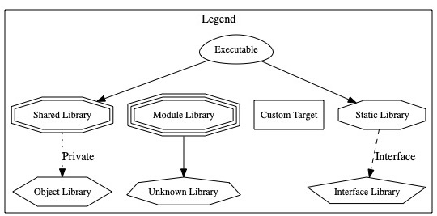
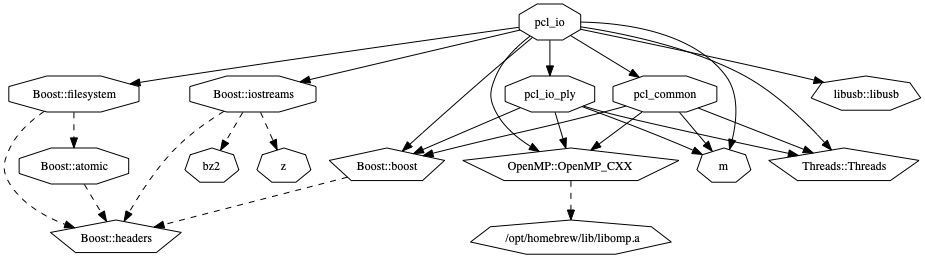
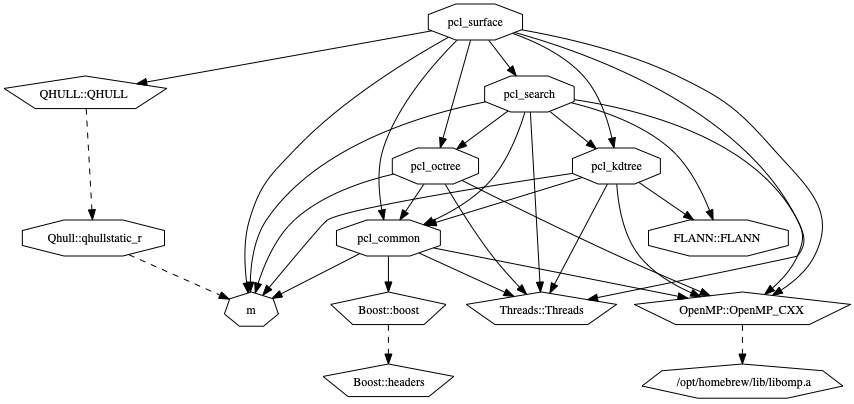

# RunPCL

PCL playground on macOS. This package allows you to play with PCL on macOS built from source either as a `.dylib` or `.a`.

## Dependencies
```bash
brew install boost eigen flann llvm libomp
```

## Preparing the PCL for build

Clone PCL and checkout desired version
```bash
$ git clone https://github.com/PointCloudLibrary/pcl.git
$ git checkout e8ed4be80
```

Create build folder. Ideally named `build_dy` for dynamic library and `build_a` for static library. Enter the build library.

### Cmake x86 static
```bash
cmake \
-D BUILD_surface_on_nurbs:BOOL=ON \
-D CMAKE_BUILD_TYPE:STRING=Release \
-D CMAKE_CXX_FLAGS_RELEASE:STRING="-Ofast -DNDEBUG -funroll-loops -fno-strict-aliasing -ftree-vectorize -fomit-frame-pointer -march=native" \
-D CMAKE_C_FLAGS_RELEASE:STRING="-Ofast -DNDEBUG  -funroll-loops -fno-strict-aliasing -ftree-vectorize -fomit-frame-pointer -march=native" \
-D PCL_SHARED_LIBS=OFF \
-D PCL_FLANN_REQUIRED_TYPE:STRING=STATIC \
-D PCL_QHULL_REQUIRED_TYPE:STRING=STATIC \
..
```

### Cmake x86 dynamic
```bash
cmake \
-D BUILD_surface_on_nurbs:BOOL=ON \
-D CMAKE_BUILD_TYPE:STRING=Release \
-D CMAKE_CXX_FLAGS_RELEASE:STRING="-Ofast -DNDEBUG -funroll-loops -fno-strict-aliasing -ftree-vectorize -fomit-frame-pointer -march=native" \
-D CMAKE_C_FLAGS_RELEASE:STRING="-Ofast -DNDEBUG  -funroll-loops -fno-strict-aliasing -ftree-vectorize -fomit-frame-pointer -march=native" \
..
```

### Cmake M1 static
```bash
cmake \
-D BUILD_surface_on_nurbs:BOOL=ON \
-D CMAKE_BUILD_TYPE:STRING=Release \
-D CMAKE_CXX_FLAGS_RELEASE:STRING="-Ofast -DNDEBUG -funroll-loops -fno-strict-aliasing -ftree-vectorize -fomit-frame-pointer" \
-D CMAKE_C_FLAGS_RELEASE:STRING="-Ofast -DNDEBUG  -funroll-loops -fno-strict-aliasing -ftree-vectorize -fomit-frame-pointer" \
-D PCL_SHARED_LIBS=OFF \
-D PCL_FLANN_REQUIRED_TYPE:STRING=STATIC \
-D PCL_QHULL_REQUIRED_TYPE:STRING=STATIC \
..
```

### Cmake M1 dynamic
```bash
cmake \
-D BUILD_surface_on_nurbs:BOOL=ON \
-D CMAKE_BUILD_TYPE:STRING=Release \
-D CMAKE_CXX_FLAGS_RELEASE:STRING="-Ofast -DNDEBUG -funroll-loops -fno-strict-aliasing -ftree-vectorize -fomit-frame-pointer" \
-D CMAKE_C_FLAGS_RELEASE:STRING="-Ofast -DNDEBUG  -funroll-loops -fno-strict-aliasing -ftree-vectorize -fomit-frame-pointer" \
..
```

### Exploring the dependency graph
You may generate dependency graph as an image. You will need graphviz.
```bash
$ brew install graphviz
```
Add following command at the end of cmake commad before `..`:
```bash
--graphviz=dep.graph
```

Use graphviz to generate jpg: 
```bash
$ dot -Tjpg dep.graph > out.jpg
```
Full graph is rendered using file above. Subgraphs have suffixes separated by dots.

Example images rendered using Cmake commands for M1 static:




### Build PCL with examples:
Add following command to the cmake (in the same manned ar graphviz)
```bash
-DBUILD_examples=ON
```
## Compilation and linking:
Use make to compile and link the library. Specify the number of threads you want to use (this will speed up the process significantly):
```bash
make -j 12
```
I have 12 threads on my macMini and 8 on my M1 macbook. 

## Compile RunPCL:
It modify `pclRoot` and `pclBuildRoot` variables in the `Package.swift` to correspond to you local location.

**Warning** the `llvm` properties were not tested on x86, see comments next to them.

**DO NOT FORGET** to check, that the versions of the libraries installed via `brew` correspond to the versions in `Package.swift`.

If you link PCL dynamically, build and run it via
```bash
swift run -Xlinker -rpath -Xlinker {pclBuildRoot}/lib
```
where the `{pclBuildRoot}` is replaced by corresponding path.

In case you link PCL statically, just use 
```bash
swift run
```
